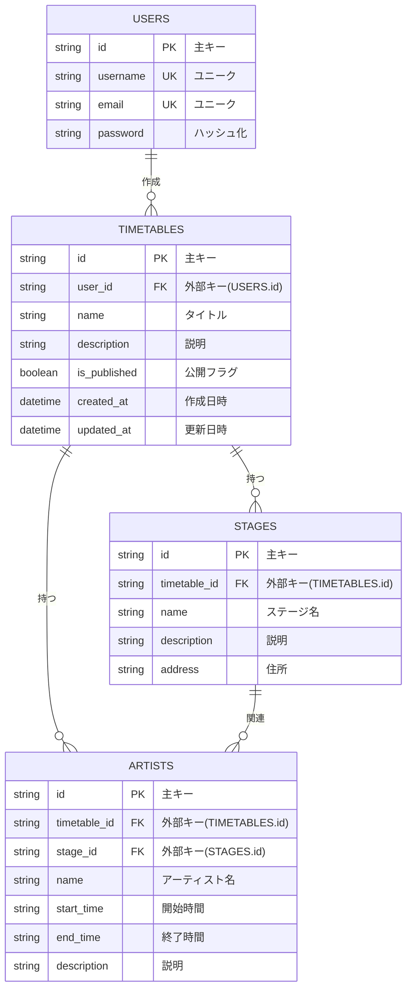
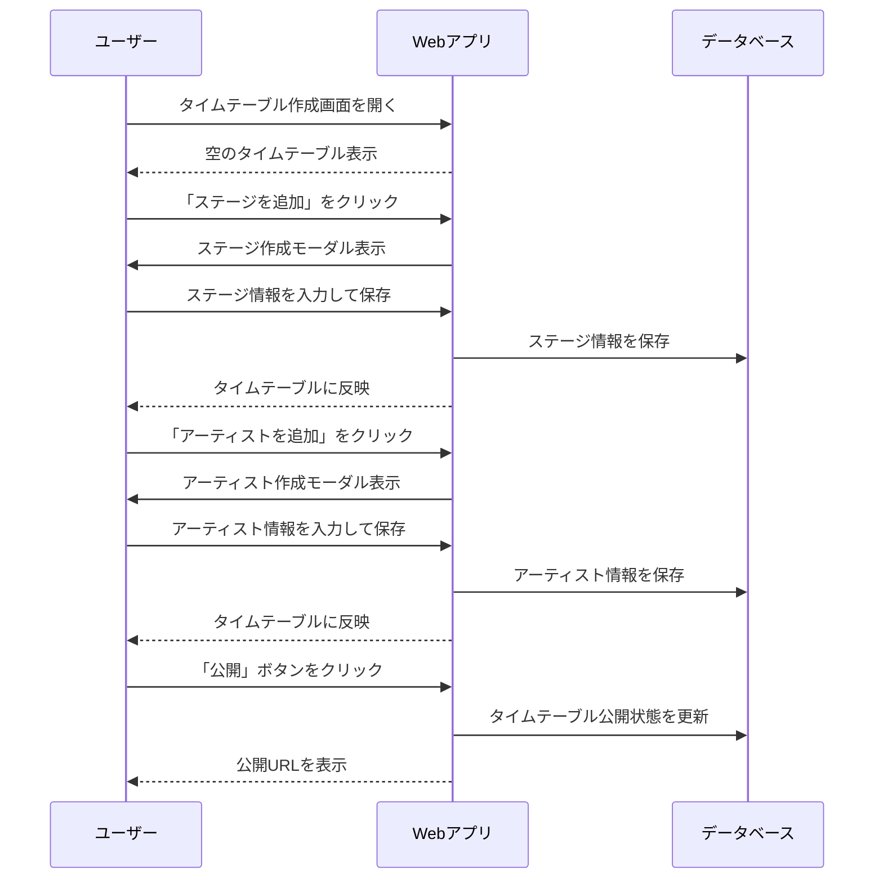

---

# **要件定義書：音楽フェス向けタイムテーブル作成アプリ**

---

## **1. プロジェクト概要**

- **目的**\
  音楽フェスのタイムテーブルを簡単に作成・編集・公開できるアプリケーションを提供し、フェス主催者や一般ユーザーの負担を軽減する。また、閲覧者が使いやすい形でタイムテーブルを参照・フォロー・通知を受けられる仕組みを構築する。

- **ターゲットユーザー**

  - **一般ユーザー**
    - 音楽フェス参加者のうち、有志でタイムテーブルを作成・公開したいユーザー。
  - **音楽フェス主催者**
    - 公式タイムテーブル作成ツールとして利用することを想定（将来的）。

- **主なユースケース**

  - 一般ユーザーが、画像形式の見にくいタイムテーブルを代わりに簡単に作成・編集・公開。
  - 公開されたタイムテーブルを閲覧し、フォローや通知を受け取ることで情報をリアルタイムで把握。
  - 作成したタイムテーブルをSNSで共有。

---

## **2. 機能要件**

### **2.1 必須機能**

#### **タイムテーブル作成**

- 空のタイムテーブルを作成。
- **ステージ追加**
  - ステージ名・説明文・住所を設定。
  - ステージ名をクリックすると、編集モーダルを開く。
- **アーティスト追加**
  - アーティスト名、出演開始時刻、終了時刻、説明文を設定。
  - アーティストのセルをクリックで編集モーダルを開く。
  - アーティストは出演時刻に応じた正確な位置に表示される。
- **自動保存機能**（アーティスト追加時に即時保存）。

#### **タイムテーブル公開・共有**

- **下書き保存**：作成途中のタイムテーブルを保存。
- **公開**：完成したタイムテーブルを公開（全体公開URLを生成）。
- **SNS共有**：公開後、SNSでタイムテーブルを共有可能（リンク形式 + プレビュー画像対応）。

#### **タイムテーブル表示**

- 縦軸：1時間単位の時間を表示。
- 横軸：ステージ名を表示し、各ステージごとにアーティストを配置。
- 公開URLでタイムテーブルを閲覧可能。

#### **認証機能**

- **Googleアカウントでのログイン**をサポート。
  - 使用技術：Devise + omniauth-google-oauth2。

---

### **2.2 今後の拡張機能**

1. **タイムテーブルのインポート**

   - OCRを活用し、画像形式のタイムテーブルを自動変換して作成。

2. **フォロー機能**

   - タイムテーブルをフォローできる機能。
   - フォロー中のタイムテーブルに変更があった際に、メールで通知を受け取れる。

3. **ネイティブアプリ化**

   - iOSおよびAndroid向けのネイティブアプリとして開発し、オフラインでもタイムテーブルを参照可能にする。

---

## **3. 非機能要件**

- **開発スピード**\
  短期間（6～8週間）での開発を目指す。

- **パフォーマンス**\
  ユーザーが公開したタイムテーブルのページ読み込みは3秒以内を目標とする。

- **対応デバイス**

  - **主デバイス**：スマートフォン（レスポンシブ対応必須）。
  - PCやタブレットでも閲覧・作成可能。

- **セキュリティ**

  - HTTPS対応（SSL/TLS）。
  - ユーザー認証はGoogle OAuth2を利用し、セキュアなログインを実現。

---

## **4. 技術要件**

### **4.1 フロントエンド**

- **フレームワーク**：Hotwire（Turbo + Stimulus）
- **CSSフレームワーク**：Tailwind CSS

### **4.2 バックエンド**

- **フレームワーク**：Ruby on Rails
- **認証**：Devise + omniauth-google-oauth2
- **データベース**：PostgreSQL

### **4.3 クラウドサービス**

- **ホスティング**：Amazon Lightsail
- **デプロイ**：GitHub Actionsを利用したCI/CD自動化。

---

## **5. データベース設計**

以下のER図に基づいて構築。

---

## **6. シーケンス図**

以下は、タイムテーブル作成から公開までの流れを表すシーケンス図です。

---

## **7. 開発スケジュール案**

### **全体期間**

6～8週間

### **ステップ1：要件定義と設計（1週間）**

- UIプロトタイプ作成（Hotwire対応）。
- データベース設計の最終確認。

---

### **ステップ2：基礎機能の開発（3～4週間）**

| 期間      | 開発内容                                           |
| ------- | ---------------------------------------------- |
| **1週目** | Railsセットアップ、Googleログイン機能実装（Devise + Omniauth）。 |
| **2週目** | タイムテーブル作成機能（ステージ・アーティスト追加）を実装。                 |
| **3週目** | Turbo Streamsを活用したリアルタイム反映、タイムテーブル表示機能を構築。     |
| **4週目** | 下書き保存・公開機能を完成、レスポンシブ対応調整。                      |

---

### **ステップ3：SNS共有機能とテスト（2週間）**

| 期間      | 開発内容                           |
| ------- | ------------------------------ |
| **5週目** | SNS共有機能の実装（リンク生成 + プレビュー画像対応）。 |
| **6週目** | RSpecを活用した単体テスト・統合テストを実施。      |

---

### **ステップ4：デプロイと公開（1週間）**

| 期間      | 開発内容                                                 |
| ------- | ---------------------------------------------------- |
| **7週目** | Amazon Lightsail環境のセットアップ、GitHub Actionsによる自動デプロイ構築。 |
| **8週目** | 本番環境デプロイと動作確認。                                       |

---
